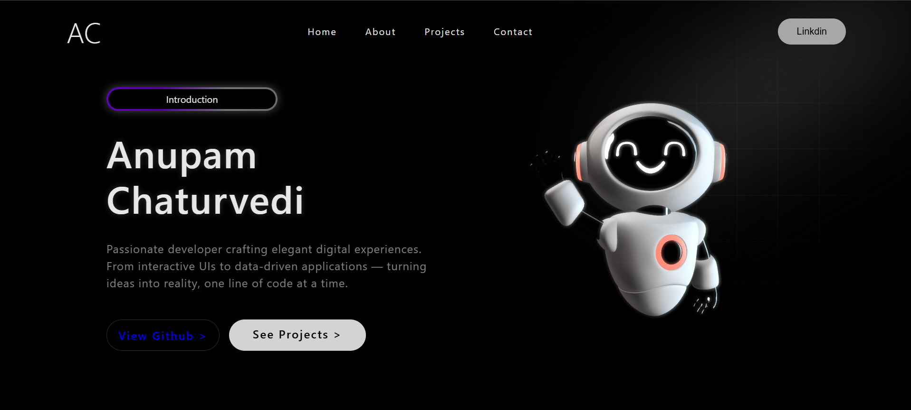

# Portfolio Home Template

A modern, fully responsive portfolio homepage template built using **HTML**, **CSS**, and **Spline**. This project features an interactive 3D experience, clean UI, and responsive design, making it a great starting point for a personal portfolio website.

---

## 🚀 Live Demo

> [https://anupamchaturvedi22.github.io/portfolio-home-template/](https://portfolio-home-template.vercel.app/)

---

## ✨ Features

- 📱 Fully Responsive Design
- 🎨 Modern & Minimal UI
- 🌐 Interactive 3D Spline Integration
- ⚡ Lightweight & Fast Loading
- 💻 Built with Pure HTML & CSS
- 📐 Clean and Organized Code
- 🎯 Beginner-Friendly Project Structure

---

## 🛠️ Tech Stack

- HTML5
- CSS3
- Spline
- Responsive Web Design

---

## 📂 Project Structure

portfolio-home-template/
│── index.html
│── style.css
│── gradient.png

---

## 📸 Preview

Example:

---

## 🚀 Getting Started

1. Clone the repository

git clone https://github.com/AnupamChaturvedi22/portfolio-home-template.git

2. Open the project folder.

3. Open `index.html` in your browser.

---

## 📌 Future Improvements

- About Section
- Skills Section
- Projects Showcase
- Contact Form
- Dark/Light Theme
- Smooth Animations

---

## 🤝 Contributing

Contributions, issues, and feature requests are welcome.

If you'd like to improve this project, feel free to fork the repository and submit a pull request.

---

## ⭐ Support

If you found this project helpful, consider giving it a **⭐ Star** on GitHub.

---

## 👨‍💻 Author

**Anupam Chaturvedi**

- GitHub: https://github.com/AnupamChaturvedi22
